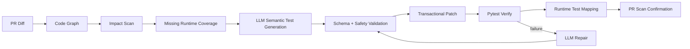

<div align="center">

# SoftGNN Advisor

### Graph-guided, runtime-proven, LLM-assisted PR testing

**Know what changed. Know what tests hit it. Generate what is missing.**

[](https://github.com/minhquang0407/softgnn-advisor/actions/workflows/tests.yml)
[](https://github.com/minhquang0407/softgnn-advisor/releases)
[](LICENSE)
[](https://www.python.org/)
[](#configure-an-llm-provider)

</div>

---

## Install

Recommended for CLI use:

```bash
pipx install softgnn-advisor
```

Or install into your current environment:

```bash
pip install softgnn-advisor
```

Optional extras:

```bash
pip install "softgnn-advisor[llm]"   # Gemini / OpenAI-compatible generation
pip install "softgnn-advisor[gnn]"   # PyTorch Geometric ranking
pip install "softgnn-advisor[all]"   # full stack
```

Then run:

```bash
softgnn setup /path/to/your-repo --project my-app
softgnn generate --project my-app
```

For local development from source:

```bash
git clone https://github.com/minhquang0407/softgnn-advisor.git
cd softgnn-advisor
python -m venv .venv
.venv\Scripts\activate  # Windows
pip install -e ".[all]"
softgnn --help
```

---

## What is SoftGNN?

SoftGNN Advisor is an experimental CLI that combines a **code graph**, **runtime test graph**, and **LLM test generation** to help you understand PR impact and generate missing pytest tests.

Most AI testing tools stop at:

```text
read changed file -> ask LLM for tests -> run pytest
```

SoftGNN aims for a stronger loop:

```text
scan PR -> find impacted code -> map tests that actually execute it -> generate missing tests -> verify -> refresh runtime proof
```

> **Core thesis:** a generated test is not truly useful until it passes pytest and proves it hits the intended code.

---

## The pipeline



---

## Why it is different

| Capability | Naive LLM test generation | SoftGNN Advisor |
|---|---:|---:|
| Reads changed code | ✅ | ✅ |
| Generates pytest tests | ✅ | ✅ |
| Validates structured LLM output | ❌ | ✅ |
| Patches transactionally | ❌ | ✅ |
| Rolls back failed generated tests | ❌ | ✅ |
| Maps tests to functions at runtime | ❌ | ✅ |
| Confirms PR coverage after generation | ❌ | ✅ |
| Supports Gemini/OpenAI-compatible LLMs | varies | ✅ |

---

## Features

- **PR impact scanning** between Git revisions.
- **Code graph extraction** from Python source files.
- **Runtime test mapping** from pytest execution to source functions.
- **Missing runtime coverage detection** for impacted functions.
- **LLM-assisted semantic pytest generation**.
- **Native Gemini provider** and **OpenAI-compatible provider**.
- **Structured JSON validation** before writing tests.
- **Safety validation** against unsafe generated code patterns.
- **Transactional patching** with generated block markers.
- **Pytest verification** and bounded generated-test repair loop.
- **Runtime refresh** after successful generation.
- **PR scan confirmation** after runtime refresh.

---

## Verified demo

On a local `social-link-prediction` repo, SoftGNN used Gemini to generate behavior tests for:

```text
FUNC:is_edge_index_sorted
```

Result:

```text
pytest: 6 passed
runtime mode: per-test
runtime edges: 336
persisted: True
missing coverage before: 0
missing coverage after: 0
```

Fallback without an LLM produced only a shallow smoke test:

```python
assert callable(is_edge_index_sorted)
```

Gemini-assisted generation produced behavior checks for sorted edges, unsorted source order, unsorted target order, single-edge input, and invalid-shape errors.

Read the full demo: [docs/examples/social-link-demo.md](docs/examples/social-link-demo.md)

---

## Install

```bash
git clone https://github.com/minhquang0407/softgnn-advisor.git
cd softgnn-advisor
python -m venv .venv
```

Windows PowerShell:

```powershell
.\.venv\Scripts\Activate.ps1
pip install -r requirements.txt
```

Linux/macOS:

```bash
source .venv/bin/activate
pip install -r requirements.txt
```

> PyTorch / PyTorch Geometric installs can be platform-specific. If installation fails, follow the official PyTorch and PyG installation guides for your environment.

---

## Configure an LLM provider

### Gemini

```powershell
$env:SOFTGNN_LLM_PROVIDER="gemini"
$env:SOFTGNN_LLM_MODEL="gemini-3-flash"
$env:SOFTGNN_LLM_API_KEY="YOUR_GEMINI_API_KEY"
```

If your API account uses another model ID:

```powershell
$env:SOFTGNN_LLM_MODEL="gemini-2.5-flash"
```

### OpenAI-compatible endpoint

```powershell
$env:SOFTGNN_LLM_PROVIDER="openai-compatible"
$env:SOFTGNN_LLM_BASE_URL="http://localhost:11434/v1"
$env:SOFTGNN_LLM_MODEL="qwen2.5-coder:7b"
$env:SOFTGNN_LLM_API_KEY="optional-if-your-endpoint-needs-it"
```

Generation strategies:

```text
template  -> deterministic templates only
llm       -> require configured LLM unless fallback is allowed
auto      -> try LLM first, fallback to templates when unavailable
```

---

## Quickstart

After setup, use `generate` for the full beginner workflow:

```powershell
softgnn setup C:\repo\my-app --project my-app
softgnn generate --project my-app
```

`generate` is the one-shot command:

```text
plan -> save latest_plan.json -> apply saved plan
```

During `apply`, SoftGNN:

```text
writes generated tests under tests/
runs pytest with streaming output
repairs failing generated tests
keeps passing generated tests
rolls back failing generated tests
refreshes runtime coverage for kept tests
saves apply feedback to ~/.softgnn/<project>/apply_runs/<run_id>/result.json
```

By default, `generate` also replans failed/rolled-back targets once:

```text
plan -> apply -> replan failed targets with apply feedback -> apply retry plan
```

To disable the extra replanning pass and save LLM tokens:

```powershell
softgnn generate --project my-app --replan-iters 0
```

Want to review proposed tests before patching? Use `plan` then `apply`:

```powershell
softgnn setup C:\repo\my-app --project my-app
softgnn plan --project my-app    # generate + save a reusable plan, no writes
softgnn apply --project my-app   # load saved plan, write tests, verify, rollback/map
```

`apply` is intentionally pure: it does **not** generate fresh tests when no saved plan exists. If there is no saved plan, run `plan` first or use `generate`.

Template-only generation, without an LLM:

```powershell
softgnn generate --project my-app --no-llm
```

Advanced commands are still available (`prepare`, `pr-scan`, `generate-tests`, `test-map`).

Mental model:

```text
setup/prepare need the repo path once
plan decides what to write
apply executes an existing plan and owns rollback
generate runs plan + apply, with one default replan attempt
```

Daily commands after setup:

| Goal | Command |
|---|---|
| One-shot plan + apply + verify | `softgnn generate --project my-app` |
| One-shot without replan | `softgnn generate --project my-app --replan-iters 0` |
| Review before patching | `softgnn plan --project my-app` |
| Apply reviewed plan | `softgnn apply --project my-app` |
| Inspect change impact | `softgnn scan --project my-app` |
| Runtime test map | `softgnn map --project my-app` |
| Health check | `softgnn doctor --project my-app` |
| Impact of one symbol | `softgnn impact --project my-app FUNC:foo` |
| Developer triage | `softgnn triage --project my-app "bug description"` |

More details: [docs/quickstart.md](docs/quickstart.md)

The full guide covers:

```text
simple CLI workflow
plan cache and apply-from-plan
one-shot generate workflow
Git PR workflow
no-Git filesystem snapshot workflow
first-run full-scan workflow
explicit target workflow
runtime coverage mapping
patch/verify/repair/partial-rollback flow
apply feedback and failed-target replanning
```

---

## Safety model

SoftGNN is conservative by default:

```text
writes tests/ only
wraps generated code in markers
validates LLM output before patching
runs pytest before accepting generated tests
rolls back failed generated edits by default
never requires committing API keys
```

Generated test blocks are marked:

```python
# <softgnn-generated target="FUNC:example" start>
...
# <softgnn-generated target="FUNC:example" end>
```

Recommended workflow:

```text
run on a feature branch
start with --mode plan
use --mode patch after review
inspect git diff before commit
```

---

## CLI highlights

```powershell
python softgnn.py pr-scan --project social-link --repo-path "C:\path\to\repo" --base main --head HEAD
```

```powershell
python softgnn.py test-map --project social-link --repo-path "C:\path\to\repo" --mode per-test --persist
```

```powershell
python softgnn.py generate-tests --project social-link --repo-path "C:\path\to\repo" --mode plan --generation-strategy auto
```

---

## Project status

Current release: **v0.1.7**

This is a developer preview. Generated tests should be reviewed before commit. Production-code fixes are intentionally out of scope for v0.1.

---

## Roadmap

Short version:

```text
M4  Runtime-Proven Test Generation
M5  Graph Impact Report / Dashboard
M6  Learned Test Prioritization / GNN Ranking
M7  Multi-Agent Quality Swarm
M8  Large-scale repo automation
M9  Controlled production-code fixes
```

Read more:

- [ROADMAP.md](ROADMAP.md)
- [docs/future-milestones.md](docs/future-milestones.md)

---

## License

MIT License. See [LICENSE](LICENSE).

